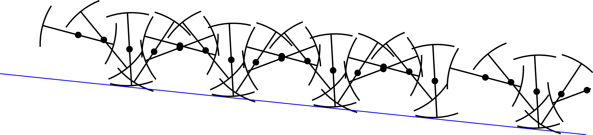

#### 画像テスト

#### 数式テスト
$$
\begin{align*}
\frac{\partial \theta}{\partial t}= \frac{\partial}{\partial z}
\left[ K(\theta) \left (\frac{\partial \psi}{\partial z} + 1 \right) \right]\
\end{align*}
$$
